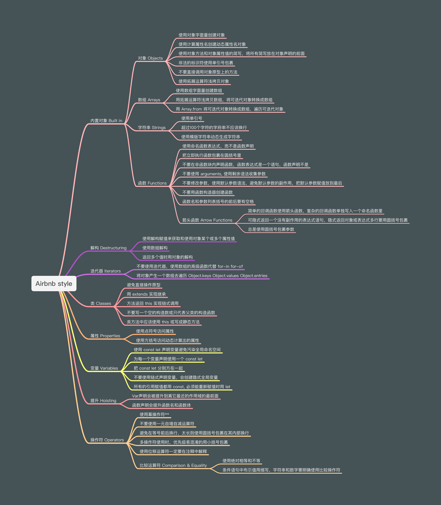
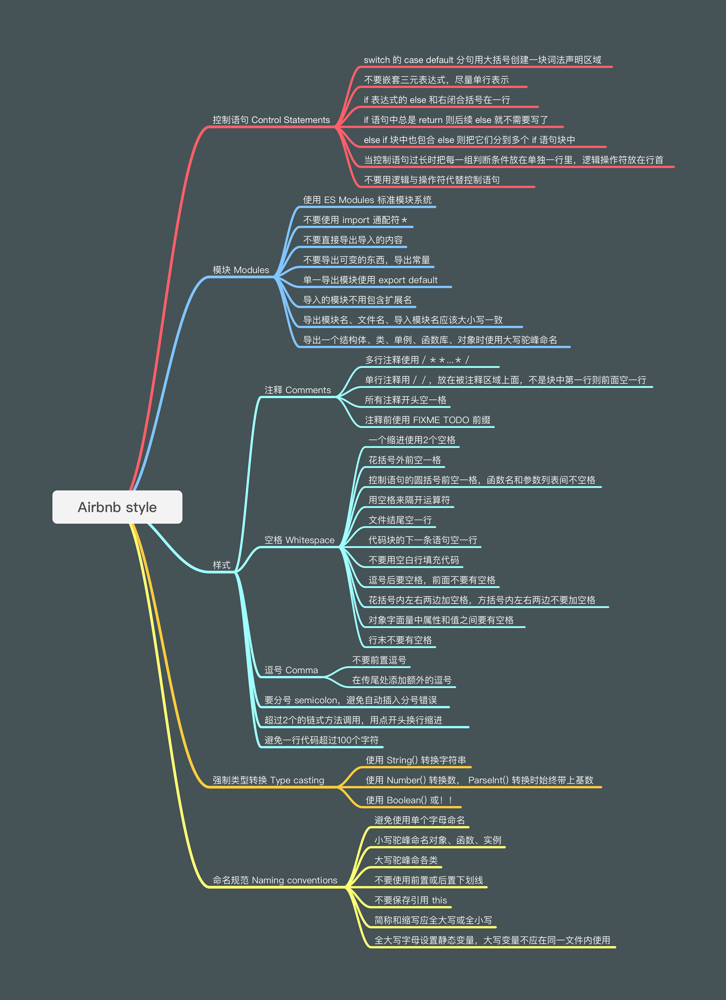

# JavaScript 代码风格

## 可读性

### 如何定义变量名

有明显意图

```JS
let elapsed
let daysSinceModification
```

避免无意义的词

```JS
let theUsers
let users
```

更好发音

```JS
let fName, lName
let firstName, lastName
```

### 如何定义函数

函数名应该是一个动词或者动词短语

```JS
// Invite a new user with its email address
function inv (user) {   }
function inviteUser (emailAddress) {   }
```

避免长的参数列表，使用一个对象代替（可以忽略传参顺序）

```JS
function getRegisteredUsers (fields, include, fromDate, toDate) {   }
function getRegisteredUsers ({ fields, include, fromDate, toDate }) {   }
```

在一个抽象层级上，函数应该只**做一件事**（更好修复、更好阅读、更好复用）

```JS
function getUserRouteHandler (req, res) {
  const { userId } = req.params
  knex('user')                      // 这里包含了完整的查询行为
    .where({ id: userId })          
    .first()
    .then((user) => res.json(user)) // 这里把查询结果反序列化
}

// User model (eg. models/user.js)
const tableName = 'user'
const User = {          // 将查询行为抽取出来
  getOne (userId) {
    return knex(tableName)
      .where({ id: userId })
      .first()
  }
}

// route handler (eg. server/routes/user/get.js)
function getUserRouteHandler (req, res) {
  const { userId } = req.params
  User.getOne(userId)               // 这里用一个方法查询了 userId
    .then((user) => res.json(user)) // 只做反序列化
}
```

尽量使用纯函数，减少副作用

```JS
function addItemToCart (cart, item, quantity = 1) {
  const alreadyInCart = cart.get(item.id) || 0
  cart.set(item.id, alreadyInCart + quantity)   // 直接修改了传入的购物车对象
  return cart                                   // 返回传入的购物车对象
}

function addItemToCart (cart, item, quantity = 1) {
  const cartCopy = new Map(cart)                // 深拷贝一份购物车对象
  const alreadyInCart = cartCopy.get(item.id) || 0
  cartCopy.set(item.id, alreadyInCart + quantity)
  return cartCopy                               // 返回拷贝的购物车对象
}
```

高层级的函数写在上面，低层级的组件写在下面

```JS
function getFullName (user) {
  return `${user.firstName} ${user.lastName}`
}

function renderEmailTemplate (user) {
  const fullName = getFullName(user)  // 调用的函数声明在了它的上面
  return `Dear ${fullName}, ...`
}
```

### 代码格式 formatting

一致的命名 consistent naming,

缩进尺寸 indentation size,

空格位  whitespace placement

分号 semicolon


# [airbnb style](https://github.com/airbnb/javascript)



